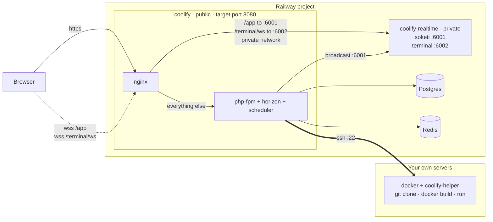

# Coolify Railway Template

Run the [Coolify](https://coolify.io) control plane on Railway: the full web UI, driving deployments on **your own remote servers** over SSH.

[](https://railway.com/deploy/coolify-1?referralCode=C3Uv6n&utm_medium=integration&utm_source=template&utm_campaign=generic)

## 🏗️ Architecture



- **coolify** — nginx, php-fpm, Horizon and the scheduler in one container under s6-overlay. The only public service.
- **coolify-realtime** — soketi and the terminal server. Private.
- **Postgres** — all durable state. **Redis** — queues and cache.

### 🐳 No Docker-in-Docker needed

Coolify never builds an image. It generates shell and pipes it over SSH — `SshMultiplexingHelper::generateSshCommand()` ends in `ssh <opts> user@host 'bash -se' << DELIM`. The `git clone` and `docker build` run on the **target server**, inside a `coollabsio/coolify-helper` container. Upstream's `docker-compose.prod.yml` mounts no Docker socket, and the production image ships `openssh-client` and `git` but no Docker client.

Strings like `docker run -v /var/run/docker.sock:/var/run/docker.sock ...` in the source are the *text of commands sent over SSH*. That socket is your server's.

## ✨ Features

- The complete Coolify UI, API, backups and notifications.
- Live deployment logs and the in-browser terminal, on a single public domain.
- Stateless — no volume. SSH keys are re-materialised from Postgres on every boot.
- Pinned images (`coolify:4.3.17`, `coolify-realtime:1.0.18`).

## 💁‍♀️ How to use

1. Click **Deploy on Railway**.
2. Deploy. First boot runs migrations and seeders; a couple of restarts while Postgres and Redis come up is normal.
3. Open the public domain and create the root account. **Do this as soon as the deploy goes live** — registration is open until the first account exists, and that account owns the instance.
4. Set the instance FQDN in **Settings** to your Railway domain.
5. **Keys & Tokens** → add your SSH key, **Servers** → add the server, validate it.
6. Deploy a project. The build runs on your server, not on Railway.

## 🧱 Infrastructure as Code

`.railway/railway.ts` defines the whole project — both databases, both services, every variable.

```bash
railway link
npm install

# First apply only; later runs omit these and preserve() keeps the values.
export APP_KEY="base64:$(openssl rand -base64 32)"
export PUSHER_APP_ID=$(openssl rand -hex 16)
export PUSHER_APP_KEY=$(openssl rand -hex 16)
export PUSHER_APP_SECRET=$(openssl rand -hex 16)

npm run plan     # read the diff before applying
npm run apply
railway domain --service Coolify
```

**Generate the domain before the final deploy.** `APP_URL` is `https://${{RAILWAY_PUBLIC_DOMAIN}}`; with no domain attached it resolves to a bare `https://` and every `php artisan` call dies with `Invalid URI`.

Three things `railway.ts` deliberately leaves alone, all because the CLI does not round-trip them and every plan would show the same pending change forever:

- `deploy.restartPolicyType` and `deploy.sleepApplication` — Railway's defaults are already `ON_FAILURE` and sleeping off.
- Cross-service variable references when the target service name contains a space. The private domain is used as a literal instead.
- Generated `*.up.railway.app` domains, which are out of IaC scope by design.

**Service names in `railway.ts` must match Railway exactly.** IaC matches by name, and a mismatch is planned as delete + recreate of a live service, not as a rename.

## 🔧 Variables

### Coolify service

| Variable | Required | Description |
| --- | --- | --- |
| `APP_KEY` | yes | `base64:$(openssl rand -base64 32)`. **Never change it** — it encrypts every registered server's SSH key. |
| `APP_URL` | yes | `https://${{RAILWAY_PUBLIC_DOMAIN}}`. |
| `DB_*` | yes | `${{Postgres.PGHOST}}` etc. The defaults point at upstream's compose hostnames. |
| `REDIS_HOST` / `_PORT` / `_PASSWORD` | yes | Reference the Redis service. Do **not** also set `REDIS_URL`. |
| `PUSHER_APP_ID` / `_KEY` / `_SECRET` | yes | Random strings; must match the realtime service. |
| `PUSHER_BACKEND_HOST` / `_PORT` | yes | `coolify-realtime.railway.internal`, `6001`. Where the **backend** pushes events. |
| `PUSHER_SCHEME` | yes | `http` — private network. |
| `REALTIME_HOST` | no | Upstream for the nginx websocket locations. |
| `PHP_MEMORY_LIMIT` | no | `256M` default; `512M` is easier with Horizon. |

**Leave unset:** `PUSHER_HOST`, `PUSHER_PORT`, `TERMINAL_PROTOCOL`, `TERMINAL_HOST`, `TERMINAL_PORT` override the browser-side websocket URL. Unset, the frontend falls back to this host with no port — exactly `wss://<domain>/app` and `wss://<domain>/terminal/ws`, which nginx proxies. `SELF_HOSTED` must stay unset too.

**Not variables at all:** `AUTOUPDATE` is defaulted to `false` in `coolify/Dockerfile` — `UpdateCoolify::update()` SSHes into `Server::find(0)` to run `upgrade.sh`, a server that does not exist here, so it fails into Horizon on every cron tick rather than no-opping. `NIGHTWATCH_ENABLED` is read by nothing; the s6 service gates on a `.env` file this container does not have.

### Realtime service

| Variable | Required | Description |
| --- | --- | --- |
| `SOKETI_DEFAULT_APP_ID` / `_KEY` / `_SECRET` | yes | `${{Coolify.PUSHER_APP_ID}}` etc. |
| `APP_NAME` / `SOKETI_DEBUG` | no | `Coolify`, `false`. |
| `SOKETI_HOST` | no | `::` in the Dockerfile; Railway's private network is IPv6. |

### Service settings

| | coolify | coolify-realtime |
| --- | --- | --- |
| Root directory | `coolify` | `realtime` |
| Builder | `DOCKERFILE` | `DOCKERFILE` |
| Target port | `8080` | — |
| Healthcheck | `/api/health` | — |
| Replicas | `1` | `1` |

Replicas stay at 1 and app sleeping stays off: Horizon and the scheduler must keep running, and a second replica would run every scheduled job twice.

## 🔌 Why the websockets go through nginx

Upstream fronts Coolify with Traefik and routes `PathPrefix(/app)` to `coolify-realtime:6001` and `PathPrefix(/terminal/ws)` to `:6002` on the dashboard's own host. Railway gives one public port per service, so that routing moves into the nginx already inside the image — same paths, same host, so the frontend's fallbacks produce the right URLs with no code change.

`coolify/entrypoint.d/05-railway-realtime-proxy.sh` renders the config at start. The `05-` prefix matters: the base image's `10-init-webserver-config.sh` only renders its own template if `http.conf` does not exist. The upstream goes through an nginx *variable* so it re-resolves — otherwise redeploying realtime silently kills the log stream.

## ⚠️ The `localhost` server is permanently unreachable

`ProductionSeeder` always creates server id 0 pointing at `host.docker.internal`, and Coolify will not let you delete it. It shows red, and the `StartProxy` / `CheckAndStartSentinel` jobs against it fail on every boot. Cosmetic — ignore it, never attach a resource to it.

Cloud mode (`SELF_HOSTED=false`) skips creating it but makes `DecideWhatToDoWithUser` require a verified email that `RootUserSeeder` never sets. Leave it alone.

## 🔐 Security

This instance holds the SSH keys to every server you register, behind one password on a public domain.

- Long unique root password, 2FA on immediately.
- Disable the API in **Settings**, or restrict `allowed_ips`.
- Back up Postgres — it is the only copy of your keys and settings.
- Losing `APP_KEY` makes every stored private key undecryptable.

## ⬆️ Upgrading

Railway template updates are opt-in — an existing deployment keeps running until you apply the update. See the [changelog](CHANGELOG.md) for what each update contains.

To move to a newer Coolify, bump `COOLIFY_VERSION` in `coolify/Dockerfile` (and `REALTIME_VERSION` to the matching `realtime` value in [versions.json](https://cdn.coollabs.io/coolify/versions.json)) and redeploy. Migrations run at boot. Only released versions get a bare semver tag on Docker Hub.

## 🧪 Run locally

```bash
docker build -t coolify-railway coolify/
docker build -t coolify-realtime-railway realtime/
```

Run both with a Postgres and a Redis, `REALTIME_HOST` pointing at the realtime container, then:

```bash
curl -fsS localhost:8080/api/health
docker exec <coolify> nginx -T | grep -A3 'location /app'
```

The second should show the resolver and hostname substituted while `$http_upgrade` is still a literal nginx variable. Test websockets with `curl --http1.1` — over HTTP/2 the upgrade headers are illegal and you get a misleading 502.

## 📝 Notes

- Nothing is built on Railway. Every build runs on the server you deploy to; configure a dedicated build server in Coolify if yours are small.
- No volume: `PopulateSshKeysDirectorySeeder` rewrites `storage/app/ssh` from Postgres on every boot.
- Railway bills egress at $0.05/GB; deployment log streaming counts.
- Source repo: https://github.com/FournyP/coolify-railway-template
- Docs: https://coolify.io/docs

## ⚖️ License

[MIT](LICENSE)
